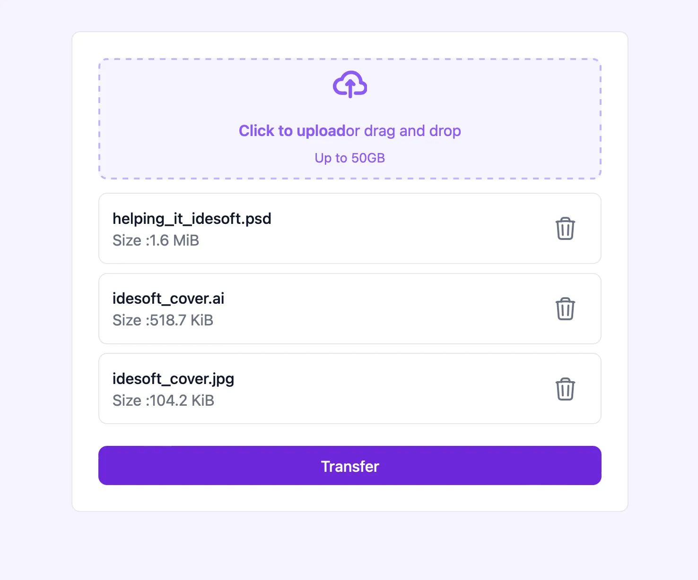

# File Uploader

This repository contains a File Uploader, explaining how to easily integrate [Leptos](https://github.com/leptos-rs/leptos), a modern Rust-based framework, with [Tailwind CSS](https://github.com/tailwindlabs/tailwindcss), a utility-first CSS framework, to build a clean, responsive user interface.
